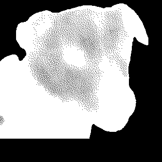
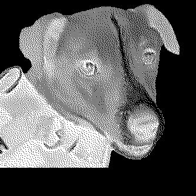
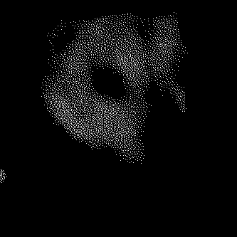
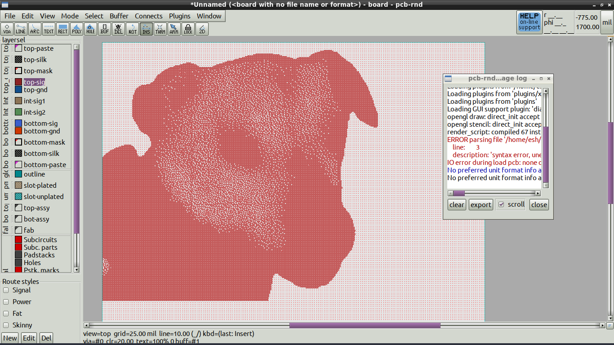
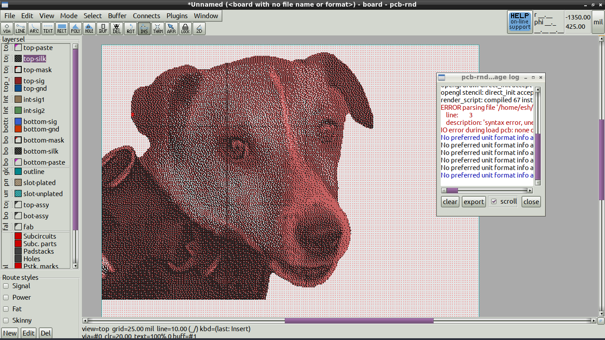
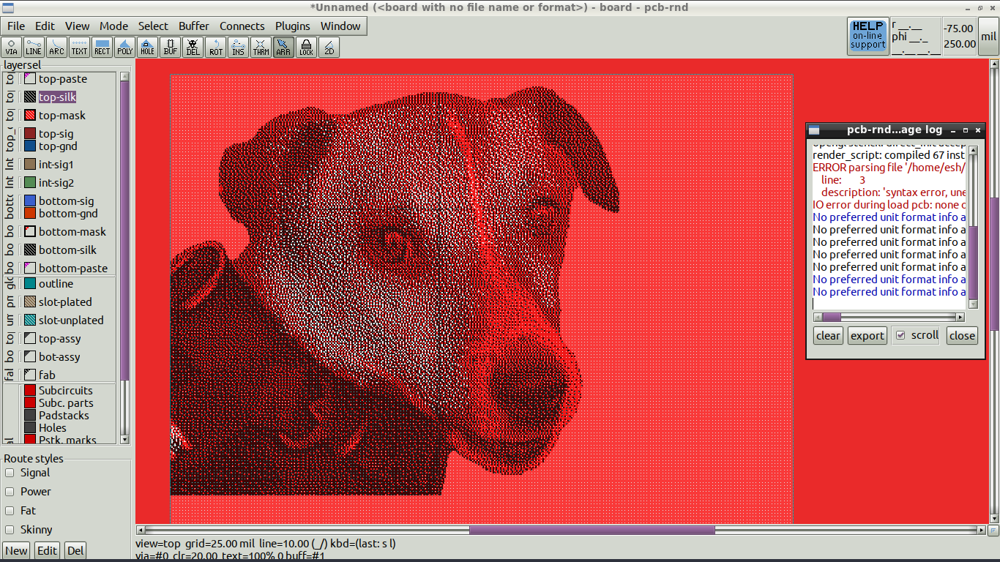
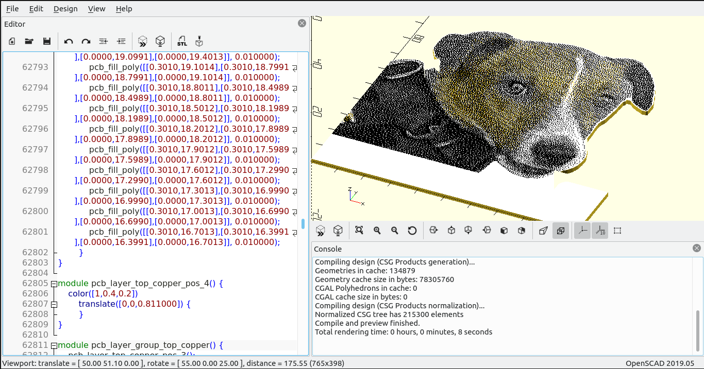

# image2footprint
image2footprint is a utility for converting images into footprint or layout artwork, which can be used to decorate a PCB, or assist in duplicating an existing PCB.

image2footprint is licensed GPL2, or at your option, GPL3 or higher.

image2footprint is a simple utility that uses the java ImageIO class to load .jpg or .png files and convert them into either footprints for placement on PCB layouts in pcb-rnd (or gEDA PCB; caveats apply), as well as layouts which can be loaded in pcb-rnd or imported as elements for placements within pcb-rnd and to a lesser extent, can be used in gEDA PCB (again, with some limitations).

The user can specify a pixel pitch (in microns), which is equal to the spacing between dots in the rendered silk screen image, in millimetres. The default is 0.5mm, which is equivalent to 500,000 nanometres.

The user can also specify a final image size (yet to be implemented) in terms of height and width, specified in mm, and the provided image will be scaled to this final size on the final footprint. The image dimensions should ideally be integer multiples, m x n, of the pixel pitch, so that the resulting image will be m x n pixels in size.

Transparent layers or any other features which are not to appear on the final footprint should be made black with a suitable graphics editor, i.e. the GIMP.

The converter assumes a white silkscreen on a dark soldermask background. For each pixel in the source image, the luminosity of the pixel is used to generate a silkscreen dot, the area of which is scaled in proportion to the source image pixel's luminosity.

The user can specify a minimum silk dot size; the default is 8mil, which is equivalent to 203 nanometres.

Specifying a minimum pixel size (in centimils) is equivalent to specifying a threshold luminosity, below which silk dots are not generated. This may be of use when converting a photograph of an existing PCB into a footprint, upon which trackwork and features can be snapped to grid to duplicate the PCB.

The user can add corner points to the top left and bottom right corners with the -cp command line flag, to assist with placement of the footprint on layouts of a defined size and with a pre-determined alignment.

The utility can also export 2 bit graphics (black and white) as a square polygon per pixel in the legacy gEDA PCB layout format. A gEDA PCB layout rather than a footprint is used because gEDA PCB footprints do not support polygon elements. The square pixels overlap by 0.1 mil to facilitate boolean polygon operations during subsequent export to gerber. The square pixel export format is useful for doing one colour at a time for an already dithered picture with an indexed palette. For example, a picture using black (silk), white (soldermask), brown (fibreglass) and silver (HASL Pb/Tin), can process the three-colour dithered layers one at a time as a black and white graphic, i.e. copper pixels:

silkscreen pixels:

solder mask pixels/apertures:

to allow the soldermask aperture artwork to be generated, and silk artwork to be generated for placement on the layout.

Each such generated layout can easily be imported into pcb-rnd, which has editable positive and negative layer types in the stackup for silk and soldermask layers, and then move the elements to the required layer.

Importing the layouts from image2footprint into layers in pcb-rnd:

copper layer:

copper and silk layers:

copper and silk layers and soldermask apertures:

and the layout exported from pcb-rnd as an openscad model for viewing (specifiying the required silkscreen and soldermask colours in the export dialogue to match the intended manufacturing colours)

gEDA PCB users may struggle to utilise more than one export in layout, and may struggle to use soldermask aperture artwork to expose the fibreglass substrate without resorting to hand editing of files, since the soldermask layer is not directly editable in gEDA PCB, and unlike pcb-rnd, a layout cannot be imported for embedding within an existing layout in gEDA PCB.

The utility exports three versions of the footprint:

- one which simply averages R,G,B values to produce a grey level,

- another which calculates luminosity based on sRGB colour weights:

  - rY = 0.212655;
  - gY = 0.715158;
  - bY = 0.072187;

- and another (yet to be implemented) which applies gamma correction before determining luminosity.

  - see http://stackoverflow.com/questions/596216/formula-to-determine-brightness-of-rgb-color

The luminosity value ( 0...n ) is then used to determine the dot size on the silk screen:

  thickness = diameter = sqrt((luminosity/n) * pitch^2)

The user can select which footprint looks best.

If the picture is of an existing PCB being duplicated, pure white pixels can be placed visually where pins are located in a graphics editor before invoking image2footprint with the -wslscp "Would Sir Like Some Cracked Pepper" option. This will place a pin on the footprint wherever a pure white pixel is found. This option, if used with the minimum pixel size (brightness) threshold, can facilitate automatic duplication of component holes and pads of an existing PCB. If combined with processing of the original image with potrace and pstoedit, to produce copper layer polygons matching the PCB tracks, duplication of an existing PCB should be quite simple.

Obviously, the appearance of the manufactured PCB will depend on the capabilities of the PCB manufacturer, and their in house conversion of the Gerber data supplied to them.

The utility can be compiled with gcj as a standalone native binary, but it seems that the gcj libraries
 are a bit broken with .png files. Natively compiled binaries seem to work fine with jpegs, however.

TODO
        - Kicad compatible export
        - gamma corrected conversion to greyscale
        - user defined scaling of the image during conversion
	- figure out why gcj libraries are broken with png image import

Usage: 

 install a jdk for your OS

 javac image2footprint.java

 java image2footprint picture.png -mp 600 -pp 400 -cp

	 -mp XXX	specify minimum pixel size(centimils)

	 -pp YYY	specify pixel pitch (microns)

	 -cp		add corner points to footprint
  
  	 -sq            use square pixels which overlap by 0.1 mil at edges

	 -wslscp	"Would Sir Like Some Cracked Pepper?" Sprinkle pins on any pure white pixels.

